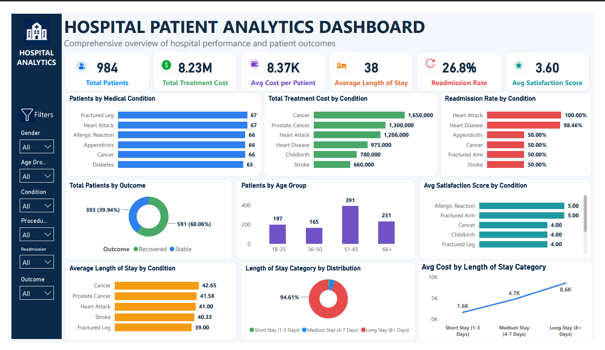

# Hospital Patient Analytics Dashboard

## Project Overview

This project analyzes hospital patient data using SQL Server, Power BI, and Excel. The goal was to examine patient volume, treatment costs, length of stay, readmission patterns, patient outcomes, and satisfaction levels.

The project combines SQL analysis with an interactive Power BI dashboard to present healthcare insights in a clear and decision-focused format.

## Project Objectives

This analysis focuses on:

- Total patient volume
- Treatment costs and average cost per patient
- Average length of stay
- Readmission rate
- Patient outcomes
- Satisfaction score trends
- Patient distribution by medical condition
- Cost and readmission patterns by condition
- Length-of-stay categories
- High-cost and readmitted patient cases

## Tools Used

- Microsoft Excel
- SQL Server Management Studio (SSMS)
- Power BI
- Power Query
- DAX

## Data Quality Check

The dataset was assessed before analysis.

- Total records: 984 patients
- No missing values were identified
- No duplicate records were found
- Patient IDs were unique
- Categorical fields such as Gender, Outcome, and Readmission were standardized
- The dataset was suitable for SQL analysis and Power BI dashboard development

## Data Preparation

The following calculated columns were created in Power BI:

- Age Group
- Length of Stay Category
- Age Group Sort Order
- Length of Stay Sort Order

These columns made it easier to analyse patient groups and keep categories in the correct order in dashboard visuals.

## Key Measures Created

The Power BI dashboard includes the following measures:

- Total Patients
- Total Treatment Cost
- Average Cost per Patient
- Average Length of Stay
- Readmitted Patients
- Readmission Rate
- Average Satisfaction Score
- Recovery Rate

## Dashboard Preview

## Key Insights

- The dataset contains 984 patients.
- The total treatment cost was approximately 8.23M.
- The average treatment cost per patient was approximately 8.37K.
- The average patient length of stay was approximately 38 days.
- The overall readmission rate was approximately 26.83%.
- A total of 264 patients were readmitted.
- Heart Attack had the highest readmission rate at 100%.
- Heart Disease had a readmission rate of approximately 98.46%.
- Cancer and Prostate Cancer had some of the highest average lengths of stay.
- Fractured Arm and Allergic Reaction recorded the highest average satisfaction scores.

## SQL Analysis

More than 20 analytical SQL questions were created and answered in SQL Server Management Studio.

The SQL analysis covered:

- Patient count and average age
- Gender distribution
- Most common medical conditions and procedures
- Total and average treatment cost
- Cost by condition and procedure
- Average length of stay
- Readmission rate analysis
- Readmission by condition and gender
- Recovery rate by condition
- Satisfaction by condition and procedure
- High-cost, long-stay, readmitted patients

## Project Files

| Folder | File | Description |
|---|---|---|
| `data/` | [Hospital Dataset](data/hospital_data.csv) | Original hospital patient dataset used for analysis |
| `dashboard/` | [Power BI Dashboard](dashboard/hospital_patient_analyticss_dashboard.pbix) | Interactive Power BI dashboard file |
| `sql/` | [Hospital SQL Analysis](sql/hospital_data_analysis.sql) | SQL queries used for patient, cost, outcome, and readmission analysis |
| `images/` | [Dashboard Screenshot](images/hospital_dashboard.png) | Final Hospital Patient Analytics Dashboard |
| `images/` | SQL result screenshots are in the files | Screenshots showing selected SQL query outputs |

## Business Value

This dashboard helps hospital stakeholders monitor patient performance and healthcare delivery outcomes in one place.

It can help decision-makers:

- Identify conditions with high treatment costs
- Monitor average length of stay
- Track readmission risk
- Compare recovery outcomes across conditions
- Review patient satisfaction levels
- Identify high-cost, long-stay, readmitted patient groups
- Support better resource allocation and discharge planning

## Conclusion

This project demonstrates my ability to clean and assess data, perform SQL analysis, create DAX measures, build an interactive Power BI dashboard, and communicate healthcare insights clearly through data visualization.
